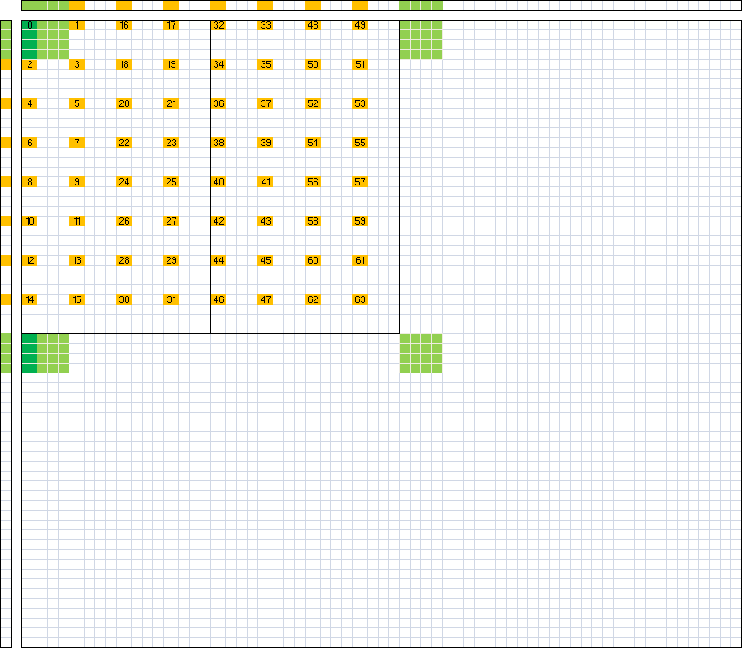

# SGEMM

### tips
1. float4
  - float4优点：减少指令数目，提高计算指令占比。在并行程度较低的情况下可能会提高LSU单元占用率。
2. 用外积替代内积 提高计算量
3. 双缓冲技术 数据预取
4. 分块读取 globalMem->sharedMem, sharedMem->register
5. 8\*8改4个4\*4避免register冲突
6. 循环展开不超过L0_I-Cache大小
7. 共享内存广播来避免冲突

## 步骤
~~~bash
# nvToolsExt
nvcc -l cublas -L /usr/local/cuda/lib64 -l nvToolsExt -o res/02_res 02_Transpose.cu
# 驱动编译
nvcc -L /usr/local/cuda/lib64 -l cuda -o res/test test.cu

# 编译并执行
nvcc -l cublas -L /usr/local/cuda/lib64 -l nvToolsExt -w -o res/00_res 00_cuTest.cu && res/00_res

# 调试
nvcc -l cublas -L /usr/local/cuda/lib64 -l nvToolsExt -w -DVALID -o res/04_res 04_MySimpleDGEMM_v9Tov11.cu && res/04_res

# cuobjdump
nvcc test_cuda3.cu -o res/test_cuda3 -gencode=arch=compute_86,code=\"sm_86,compute_86\"  -gencode=arch=compute_52,code=\"sm_52,compute_52\" -gencode=arch=compute_75,code=\"sm_75,compute_75\"
cuobjdump -ptx res/test_cuda3 > res/test_cuda3.ptx
cuobjdump -sass res/test_cuda3 > res/test_cuda3.sass

# CuAssembler
nvcc --keep -gencode=arch=compute_86,code=\"sm_86,compute_86\" -I/opt/kaiProjects/GEMM_kai/Utils -L /usr/local/cuda/lib64 -l cuda -o res/regBankTest regBankTest.cu 

nvcc --dryrun -gencode=arch=compute_86,code=\"sm_86,compute_86\" -I/opt/kaiProjects/GEMM_kai/Utils -L /usr/local/cuda/lib64 -l cuda -o res/regBankTest regBankTest.cu 2>&1 | tee regBankTest_dryrun.sh

cuasm --bin2asm regBankTest.sm_86.cubin -o regBankTest.sm_86.cuasm

## mod regBankTest.sm_86.cuasm

mv -f regBankTest.sm_86.cubin regBankTest.old.sm_86.cubin && cuasm --asm2bin regBankTest.sm_86.cuasm -o regBankTest.sm_86.cubin

# 将cubin汇编为二进制
bash regBankTest_dryrun_drv.sh

## 运行test_regBank.py

# asm2bin 
cuasm --asm2bin save/regBankTest.sm_86_my.cuasm -o regBankTest.sm_86.cubin

# nsight system
nsys profile --stats=true -f true -o profileRes/00_proRes res/00_res

# 其他
rm -rf !(regBankTest.cu) && mkdir res
~~~

## 早期自己的思路

- regsPerBlock和regsPerSM都是65536 这些是指32bit的寄存器
- 为了用满SM的3\*16个warp，限制一个block是32\*16个线程 一个SM启动三个block，那么一个block先用1/4regs 256*64个
- 如果是连续两个regs存一个double的话，一个block处理256\*32个，就是16个double每线程?

- smemPerBlock是49152=128\*128\*3 smemPerSM是102400=32\*32\*100 一个SM要启动三个block，一个block就用1/3smemPerSM 128*256字节
- 限制一个block是32*16个线程 就是64字节每线程 就是8个double每线程

#define BLOCK_XY 256
#define SMEM_Y 128
#define SMEM_X 16
#define REG_Y 8
#define REG_X REG_Y

- 一个SM最多启动 3*16个warp
- BLOCK_XY是256，8个warp。最多启动6个Block

- SM限制共享内存最多100KB Block限制共享内存最多3*16KB
- 共享内存 2\*2\*sizeof(float)\*SMEM_Y\*SMEM_X = 32K
- 一个SM就能启动3个Block

- SM一共65536个寄存器 启动2个block的话 256的block 一个线程只能用128个寄存器
- 寄存器ABC 一共需要 (REG_Y + REG_X)\*2 + (REG_Y\*REG_X) = 96
- A矩阵在共享内存转置的时候 还需要 (SMEM_Y * SMEM_X) / BLOCK_XY = 8个寄存器。
- 单次寄存器只处理 4\*4的C矩阵  尽可能避免共享内存和寄存器bank冲突

## 其他

r68 - r75   
r76 - r91
r12 - r23   3
r28 - r31   1
r40 - r51   3
r56 - r59   1

16KB L0_I-Cache  一条指令16B \* 1024 
3091-744= 2347

M=N=4096 K=2048
cublas：10.12ms
目前峰值：9.88ms