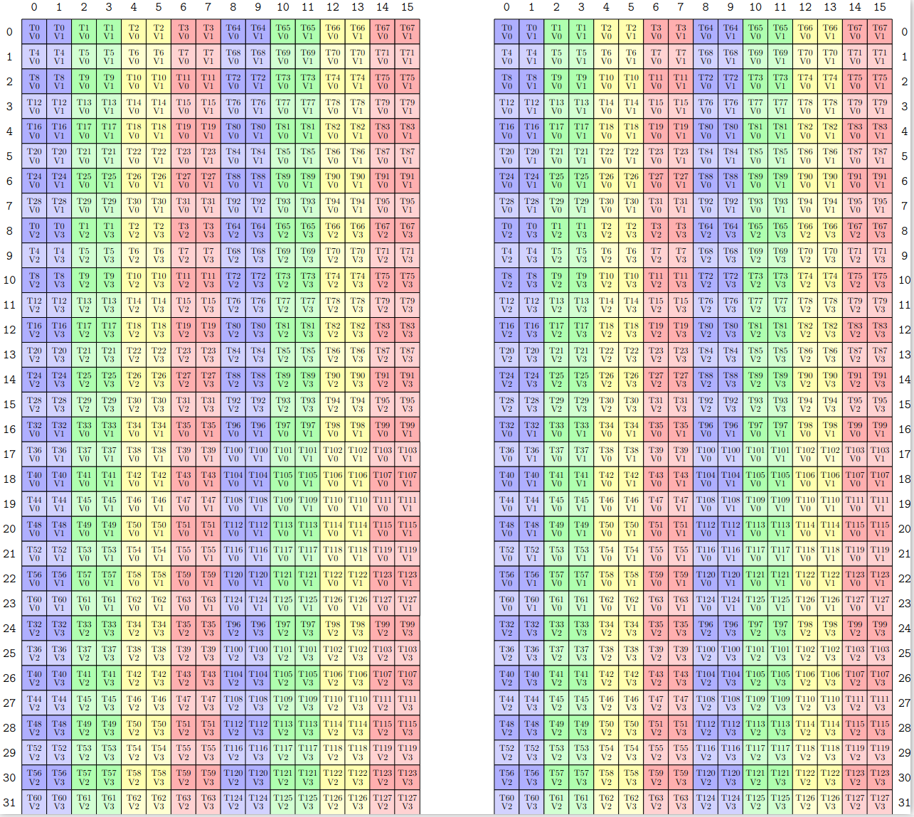

## Cute
### Layout
- index_physical = index_logical * stride
- 在cute体系下，逻辑空间可以被称作domain，而代表存储的物理空间称作codomain(cosize)

- shape: ((内部行数，外部行数1, 外部行数2,...),(内部列数，外部列数1,外部列数2,...))

#### slice

### Tensor
- Tensor = Layout + Storage

~~~C++
// 栈上对象：需同时指定类型和Layout，layout必须是静态shape
Tensor make_tensor<T>(Layout layout);

// 堆上对象：需指定pointer和Layout，layout可动可静
Tensor make_tensor(Pointer pointer, Layout layout);
 
// 栈上对象，tensor的layout必须是静态的
Tensor make_tensor_like(Tensor tensor); 

// 栈上对象，tensor的layout必须是静态的
Tensor make_fragment_like(Tensor tensor);

// 栈上对象在GPU表现为寄存器空间
~~~

- local_tile

- local_partition

### MMA

- MMAOperation提供了指令层的封装

- MMA_Traits
  - MMAOperation的使用者是MMA_Atom，但是MMA_Atom所需要的信息又比MMAOperation本身提供的要多，这时引入MMA_Traits则填补上它们之间的这个空隙。

- MMA_Atom 是硬件提供的能执行的矩阵乘法的最小的单位，其能完成一个特定规格(如MNK)的矩阵乘法问题 D = A x B + C

- TiledMMA，是原子的整数倍。
  - 这种扩展可以是执行单元层面的
  - 也可以是对Atom重复执行

- ThrMMA将逻辑的矩阵根据threadIdx 获得本线程的任务（可以是warp level的等）。

- ThrMMA得到各个线程的计算任务后，各个线程同时调用cute::gemm函数完成各个线程级别的任务下发

#### TiledMMA_Layout
~~~C++
TiledMMA tiled_mma = make_tiled_mma(SM80_8x8x4_F64F64F64F64_TN{},
                                    Layout<Shape<_1,_1,_1>>{},
                                    Tile<_8,_16,_8>{});
~~~

~~~C++
TiledMMA tiled_mma = make_tiled_mma(SM80_8x8x4_F64F64F64F64_TN{},
      Layout<Shape<_1,_1,_1>>{},
      Tile<_8, 
            Layout<Shape <_2,_4,_2>, 
                  Stride<_1,_4,_2>>,
            _8>{});    
~~~

- (2, 4, 2) (1, 4, 2)  => (2, (4, 2)) (1, (4, 2))

|       | (0, 0) | (1, 0) | (2,0) | (3, 0) | (0, 1) | (1, 1) | (2,1) | (3, 1) |
| ----- | ------ | ------ | ----- | ------ | ------ | ------ | ----- | ------ |
| **0** | 0      | 4      | 8     | 12     | 2      | 6      | 10    | 14     |
| **1** | 1      | 5      | 9     | 13     | 3      | 7      | 11    | 15     |

- 0 1 4 5 8 9 12 13 2 3 6 7 10 11 14 15
  - 一维offset  按列主序 + 低维=>高维的读法就是
- 这代表 Map from Old LogicalIdx to New LogicalIdx
  - 如下图中间部分，OldLogicalIdx==2的元素应该映射到NewLogicalIdx==4位置。
  - 下图下半部分排好序后，就得到了 Layout(2, 4, 2) (1, 4, 2)  的样子。

### Copy

- Tiled抽象通过对Atom能力进行重复得到更大的块的拷贝能力，对Atom的重复可以通过提供线程-存储的Layout来提供，也可以直接通过提供Atom能力和MMA中的tiled_mma实现 

- retile系列的函数表示其输入的数据已经是当前的线程的私有的数据了，但是其可能不满足拷贝所要求的形状，需要将其变换到拷贝所支持的形状

#### ldmatrix
- ldmatrix.sync.aligned.x4.m8n8.shared.b16 {%0, %1, %2, %3}, [%4];

### Swizzle
- 如上ldmatrix每次加载共享内存逻辑位置的 8\*8个half = 8\*16B 
- 这会造成共享内存冲突，为了避免它，把8行逻辑位置映射到不同的phase的物理位置（bank块）
  - ibank = irow ^ icol;

- Swizzle定义了三个参数: M、S、B。它们共同表达描述一维坐标向二维空间映射的三个层次。
  - 首先将一维中连续的几个元素作为新空间中的基础元素
  - 然后描述该二维空间有多少行和列。
  - 其中一维坐标中连续的2^M^个元素构成二维空间中最基本的元素，2^S^表示新的二维空间中有多少列，2^B^表示新的二维空间中有多少行。

- 在实际操作时，如我们有一块half类型，shape:(8, 32), stride: (32, 1)的共享内存，我们定义Swizzle<3, 3, 3>作用到该shared memory Layout上，形成 A = Composition(Swizzle<3, 3, 3>{}, Layout<Shape<8, 32>, Stirde<32, 1>>{}); 则Layout中有效的offset为0 - 256。Swizzle中M为3，所以8个元素形成一个新的最小的元素，即8x2byte = 16byte；Swizzle中S为3，所以2D空间中一行包含8个元素，则有8x16byte = 128byte，128byte为shared memory无conflict访问所有bank的最大宽度；Swizzle中B为3，则2D空间irow更新的间隔为8。如此则实现了将一个逻辑的空间向2D的shared memory空间的映射，其中列的宽度为128byte占满所有的bank，行列异或后得到新的列号，避免了在bank方向（亦即icol方向）的冲突。

## GEMM流程
- (128, 128, 32) 的 CTA_Tile
- 一个 TiledMMA 一次处理 (32, 32, 16) = (16, 8, 16) \* (2, 2, 1) \* (1, 2, 1) 块
  - MMA_M=MMA_N=4, MMA_K=2
- G2S_TiledCopy 用LDG.128 一次加载 (32, 4) \* (1, 8) 个元素(half)
  - CPY_M=CPY_N=4, CPY_K=1
- S2R_TiledCopy 用ldmatrix 一次加载 (8, 8)x4 \* 2 = (32, 16) 个元素
  - CPY_M=CPY_N=4, CPY_K=2

- R2S_TiledCopy 用UniversalCopy<int> 把TensorCore计算结果  (32, 32) 个元素 存回
  - CPY_M=CPY_N=4
- S2G_TiledCopy 用UniversalCopy<uint128_t> 做反向G2S
- 每pipe次R2S 都会触发pipe次S2G
  - pipe=2 * 8次外循环

###  Compute
- CTA Level: 128 128 32

- Warp Level: 32 32 16 = (16 8 16) \* (2, 2, 1) \* (1, 2, 1)

### G2S
- (32, 4) \* (1, 8)
- 32行 32列元素 用LDG.128指令加载，分布图如下

- (32,4) (4, 1) 表示行主序排列线程
- (1, 8) 表示值加载 行方向重复8次，列方向1次

#### SMemLayoutAB
- （128, 32, 3）= (8, 32) \* (16, 1, 3)
- (8, kTileK) + Swizzle333
  - kTileK=32，一个warp LDG.128 能加载8行。
- 经过测试 333确实比233块一点点点 233会增加20%的共享内存冲突。

### S2R
- ldmatrix.sync.aligned.x4.m8n8.shared.b16 
  - 16bit数据类型的 8*8矩阵 加载4个

### R2S
- UniversalCopy<int>
- tiled_mma的结果(32, 32) 转换成bank的phase=8形式写入就是 (16, 8)
  - 逻辑两行会写在物理一行
  - phase=8 swizzle后是(4, (8, 8))
- 一个warp 写S中元素的时候 会写入(8, (8, 2))
  - 对应swizzle后的 (\_, (\_, 0)) (\_, (\_, 2)) (\_, (\_, 4)) (\_, (\_, 6))
- 下图既可以看作 左S右D， 也可以看作完整的S(32, 32)

#### SMemLayoutC
- (32, 32, 2) = (32, 32) * 2
  - 2就是pipe
- (32, 32) + Swizzle233
  - 4行 8个元素 8列 (2, (3, 3))

### S2G
- UniversalCopy<uint128_t>
  - GPU中只有内存加载操作能被缓存，内存存储操作不能。
  - 凑一个128B写内存事务